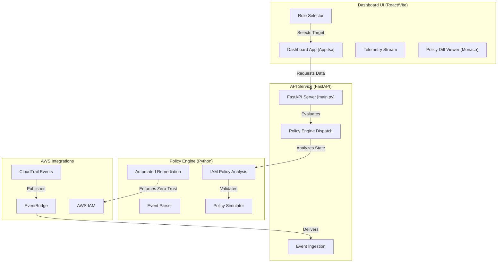

# Zero-Trust IAM Policy Engine 🛡️

An enterprise-grade security dashboard designed to ingest CloudTrail events, simulate least-privilege remediation, and visualize policy comparisons in real-time via a side-by-side Monaco Editor. 

 

---

## 🏗️ Architecture & Workflow

The platform operates as an end-to-end telemetry and remediation pipeline:

✨ Key Features
Live Telemetry Stream: Ingests and displays real-time security events using Server-Sent Events (SSE).

Side-by-Side Policy Diff Viewer: Powered by Monaco Editor with custom decorations highlighting hazardous wildcards (s3:*, *) vs. scannable least-privilege rules.

Real-Time Security KPIs:

Risk Score: Quantifies exposure based on wildcard density and administrative privileges.

Wildcard Reduction: Measures percentage reduction of overly broad permissions.

Simulation Pass Rate: Validates that candidate least-privilege policies maintain operational uptime.

Offline & Connected Modes: Automatically falls back to robust mock payloads and telemetry when AWS credentials are absent, ensuring seamless local demonstrations.

🛠️ Tech Stack
Frontend
Framework: React 18, Vite, TypeScript

Styling: Tailwind CSS, Lucide Icons

Editor: @monaco-editor/react (Custom JSON Diff & Syntax Highlighting)

Backend
Framework: FastAPI, Python

AWS Integration: Boto3 (IAM, CloudTrail, EventBridge)

Engine Modules: Custom Event Normalizer, Policy Simulator, and Least-Privilege Generator

🚀 Getting Started
Prerequisites
Node.js (v18+)

Python (v3.10+)

1. Clone the Repository
Bash
git clone [https://github.com/prakya-tech105/aws-zero-trust-iam-policy-engine.git](https://github.com/prakya-tech105/aws-zero-trust-iam-policy-engine.git)
cd aws-zero-trust-iam-policy-engine
2. Run the Backend (FastAPI)
Bash
cd backend
python -m venv .venv
source .venv/bin/activate  # On Windows use: .venv\Scripts\activate
pip install -r requirements.txt
uvicorn main:app --reload --port 8000
3. Run the Frontend (React / Vite)
Open a separate terminal window:

Bash
cd frontend
npm install
npm run dev
Open your browser and navigate to http://localhost:5173 (or the port specified by Vite).

📄 License
Distributed under the MIT License. See LICENSE for more information.
